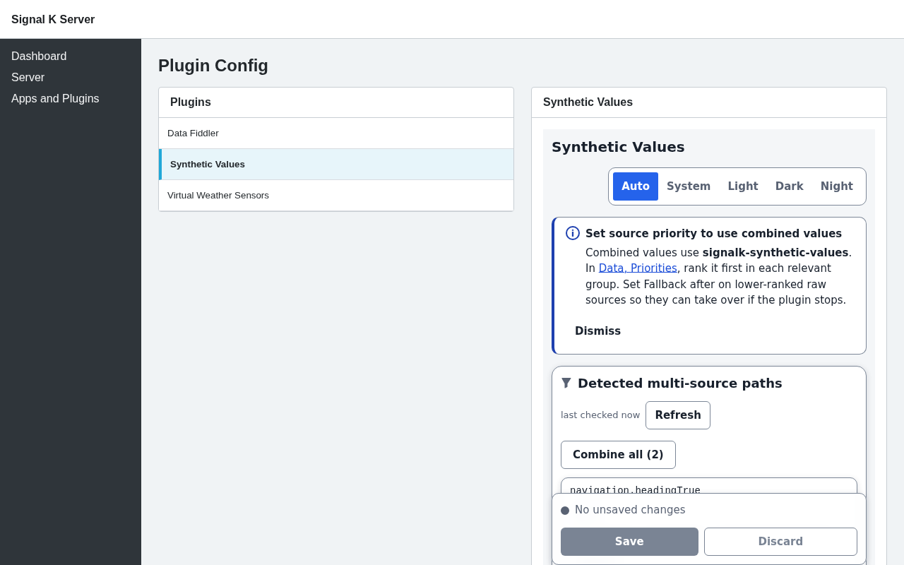

# Synthetic Values

[](https://www.npmjs.com/package/signalk-synthetic-values)
[](https://www.npmjs.com/package/signalk-synthetic-values)
[](https://github.com/NearlCrews/signalk-synthetic-values/actions/workflows/ci.yml)
[](https://github.com/NearlCrews/signalk-synthetic-values/blob/main/LICENSE)
[](https://nodejs.org)
[](https://www.buymeacoffee.com/nearlcrews)

When two or more sources feed the same Signal K path (multiple GPS receivers, duplicate depth sounders, redundant heading sensors), the server picks one source at a time and ignores the rest. Synthetic Values watches all sources together, computes a single robust value from them, and emits it as an additional source on the same path so one flaky or biased sensor cannot drag the result.

## What's new in 0.5.5

Version 0.5.5 updates the shared configuration panel and adds the license
notices the packaged panel owes.

- **Third-party notices.** The panel ships as a bundle that carries its
  dependencies, so the package now includes a generated `THIRD_PARTY_NOTICES.md`
  with each license text, regenerated from what the bundler actually emits and
  verified on every packaging check.
- **Shared UI 0.8.2.** The panel bundles the current shared component release,
  including the control-token minimum width that keeps compact and icon-only
  buttons on the same touch target.
- **Ages in words.** The detected-path list reads "last checked 5 minutes ago"
  rather than an abbreviated stamp.
- **Node floor kept honest.** The Node type definitions now match the Node 20
  runtime the plugin advertises, so code a Cerbo GX cannot run no longer passes
  the build checks, and a blocking CI lane proves the built plugin still loads
  on that floor.

See the [v0.5.5 changelog entry](https://github.com/NearlCrews/signalk-synthetic-values/blob/main/CHANGELOG.md#v055) and the
[full release history](https://github.com/NearlCrews/signalk-synthetic-values/releases).

## Screenshots



The App Store hero shows the production panel inside current Signal K Admin
chrome. Detailed configuration, not-recommended-path, tuning, and Data Browser
captures follow in the package screenshot gallery.

## Why you'd want this

Many boats carry more than one of the same instrument: two or three GPS receivers, a backup depth sounder, a couple of compasses. Signal K can only show one of them at a time for each reading, and it simply uses whichever sensor reported most recently. If that one happens to be drifting, noisy, or briefly wrong, your position jumps, your heading wanders, or your depth reads badly, even though a perfectly good sensor is sitting right next to it.

Synthetic Values fixes that. It listens to all of your duplicate sensors at once and publishes a single steadier reading made from them together. Think of it like asking three people for the time and going with the answer in the middle, rather than trusting whoever happened to speak last. One sensor going haywire no longer throws off the number you navigate by, and the value you see is usually more accurate and far less jumpy than any single sensor on its own.

You stay in control. The combined reading is published as its own extra source, so your original sensors are untouched and still visible. You choose which readings to combine (the plugin shows you which ones actually have duplicates), and you tell Signal K to prefer the combined value when you are ready. Nothing on your boat changes until you opt a reading in.

## What it does

Signal K is an open marine data standard that streams a boat's navigation, environment, and AIS data over a single API. When redundant sensors all feed the same path, the server picks whichever source wrote last: a stuttering GPS can make the chartplotter jump, and a bad depth sounder can suppress a good one.

Synthetic Values subscribes to every source on the opted-in paths, applies a combining method (median by default), and emits the result under the plugin's own source label. Because the result rides a separate source, it does not displace raw sensor data and real-instrument consumers can still see the underlying sources.

The plugin handles four value kinds:

- **Scalar:** standard numeric combining. Median is robust; trimmed mean and mean are available. Whole-source outlier rejection uses scaled MAD at four or more sources, while a configured `rejectThreshold` always provides an absolute rejection ceiling.
- **Angular:** headings, bearings, and any path with radian units. Combines without the 0/360-degree wrap artifact, honoring the `method` setting: `median` (the default) uses the circular medoid, the reading closest to the others, so one off compass cannot drag the result; `mean` uses the circular mean. Suppresses the synthetic value when the circular pairwise spread exceeds `angularSpreadThreshold`, so a sensor pointing 180 degrees from the rest does not produce a meaningless average.
- **Position:** latitude/longitude pairs. Combines latitude with the selected linear statistic and longitude with an antimeridian-safe circular statistic. `mean` uses the circular mean, while `median` and `trimmedMean` use the robust circular medoid. Per-source geodesic-distance rejection keeps a phantom GPS fix from dragging the result.
- **Attitude:** the `navigation.attitude` object, with roll, pitch, and yaw combined independently as angular components. A source whose attitude is off on any axis is rejected, and the synthetic value is suppressed if any axis is too scattered. This is the Signal K way to fuse several motion sensors into one attitude, then prefer it by source priority, the same outcome as selecting a source on a Garmin display.

A staleness timeout excludes sources that have not sent a fresh reading within the configured window. A one-second availability sweep updates status when every source goes quiet without periodically re-emitting the last combined value.

## Installation

Install from the Signal K admin UI under **Apps and Plugins, then Store**, or from npm:

```bash
cd ~/.signalk
npm install signalk-synthetic-values
```

From source:

The published plugin supports Node 20.18 or newer at runtime. Building from
source requires Node `^22.22.2 || ^24.15.0 || ^26.0.0` and npm 12.0.2; the
checked-in `.node-version` selects Node 22.23.1.

```bash
git clone https://github.com/NearlCrews/signalk-synthetic-values.git
cd signalk-synthetic-values
npm ci
npm run build
ln -s "$(pwd)" ~/.signalk/node_modules/signalk-synthetic-values
```

## Configuration

In the Signal K admin UI, open **Server, then Plugin Config**, find "Synthetic Values", and enable the plugin. The plugin is disabled by default.

### Configuration panel

Once enabled, the plugin replaces the raw JSON form with a purpose-built configuration panel. The panel shows a live list of every Signal K path the plugin has seen with two or more distinct sources. Each row displays the path name, source count, a kind badge, and the source names as chips. Combinable values are classified as scalar, angular, attitude, or position; unsupported values show as other, and configured paths awaiting live data show as unknown.

The panel bundles `signalk-nearlcrews-ui` 0.8.2 for accessible controls, shared
marine theming, and isolated styles. Auto follows a host theme when one is
published and otherwise stays Light to match the current Signal K Admin shell. System
explicitly follows the operating-system preference. Light, Dark, and Night
remain direct choices, and all five choices are shared with other panels that
use the library. Night changes this panel, not the surrounding Admin chrome.
The retired Synthetic Values `skn-theme` preference is intentionally ignored.

The shared UI requires native CSS `@scope`: Chromium and Edge 118 or newer,
Firefox 146 or newer, or Safari 17.4 or newer. Older browsers and embedded
WebViews receive a browser-update message instead of an unstyled panel.

Sources that stop reporting age out of the detected list after one minute. Configured paths remain visible while offline, so they can still be tuned or removed while discovery is rebuilding.

- **Combine** updates the panel immediately and queues one path with default settings.
- **Combine all** queues every recommended path at once after a confirmation step. It skips paths that are detected but not meaningful to average (see below).
- **Remove** updates the panel immediately and queues removal from combining.
- **Tune** (per opted-in path) opens a settings panel with: the combining method (median, trimmed mean, or mean), minimum sources, and a per-source include/exclude checklist. An **Advanced** sub-section exposes MAD threshold, reject threshold, disagree threshold, angular spread threshold, trim fraction, angular override, jump rejection max rate, slew limit, staleness timeout, and emit interval.

Panel edits are coalesced for 300 milliseconds and sent as the newest complete
snapshot. Signal K Admin's panel callback only acknowledges that a save was
requested, so the panel does not claim persistence from that return value.
Unknown top-level and per-path configuration fields are retained when the panel
writes known settings, which keeps configurations forward compatible.

Paths that are detected but not meaningful to average are grouped under **Detected but not recommended**. This covers two cases: values that are not supported combinable shapes (text and other objects, which cannot be averaged), and numeric GNSS fix metadata that describes a single receiver's solution rather than a measured quantity (the satellite count, dilution of precision, and differential-correction age and reference). A plotter shows GNSS metadata so you can judge the fix it is using, but averaging it across receivers is not meaningful, so it is kept out of "Combine all". You can still combine numeric GNSS metadata by hand if you have a reason to; text and unsupported objects remain disabled.

When two or more sources report identical values while the value is changing, the panel flags them as likely the same feed re-broadcast (for example a GPS forwarded by an autopilot under a second source name). Re-broadcast sources are not independent, so counting each one dilutes the combined value toward that single feed. The panel names the duplicates and suggests excluding all but one in the path's **Tune** section; it never excludes a source for you, since identical values can also be legitimate.

After you opt in a path, the panel shows a priority reminder: you must still rank `signalk-synthetic-values` first in the relevant Signal K priority group for the combined value to win (see "Make the synthetic source win" below). The panel links to the group-based priority screen and offers a path-level override link, but it does not change priority for you.

Detected multi-source paths are also available programmatically at `GET /plugins/signalk-synthetic-values/api/detected`.

### Global options

The runtime honors the top-level options below. The current custom panel
preserves existing values but does not edit them.

| Option | Default | Description |
| ------ | ------- | ----------- |
| `defaultStalenessTimeoutMs` | `1000` | A source whose last receipt is older than this is excluded from combining. Override per path with `stalenessTimeoutMs`. |
| `defaultEmitMinIntervalMs` | `1000` | Minimum interval in milliseconds between synthetic emits for a path. Override per path with `emitMinIntervalMs`. |
| `defaultMinSources` | `2` | Minimum fresh sources required to emit a combined value. Set to `1` to pass through a single-source path without combining. Override per path with `minSources`. |
| `maxSourcesPerPath` | `16` | Global cap on tracked and detected sources per path, from `1` to `64`. |

### Per-path options

Click **Combine** on each detected path you want to opt in. The current panel
can add only paths it has already seen with two or more sources. Existing saved
paths remain visible while offline. The runtime accepts every option below, but
the panel preserves rather than edits `outlierRejection`,
`jumpRejection.persistSamples`, and `jumpRejection.persistMs`.

| Option | Default | Description |
| ------ | ------- | ----------- |
| `path` | required | The Signal K path to combine. |
| `method` | `median` | Combining method: `median`, `trimmedMean`, or `mean`. For angular paths and position longitudes, `mean` uses the circular mean; `median` and `trimmedMean` use the circular medoid (the reading closest to the others). |
| `trimFraction` | `0.25` | Fraction in the range `[0, 0.5)` trimmed from each end when using `trimmedMean`. The count trimmed from each end is `floor(N * trimFraction)`, so small sets may remain untrimmed. |
| `outlierRejection` | `true` | Reject whole-source outliers before combining. |
| `madThreshold` | `3` | Sigma-equivalent multiplier for scaled-MAD outlier rejection when N is 4 or more. |
| `rejectThreshold` | unset | Absolute rejection ceiling in kind units: meters for position, radians for angular and attitude, and value units for scalar. It also applies when scaled-MAD rejection is active. |
| `disagreeThreshold` | unset | Absolute distance in kind units above which sources are flagged as disagreeing in the plugin status. The combined value is still emitted. |
| `angularSpreadThreshold` | `pi/2` | Angular paths only: maximum circular pairwise spread in radians. Sources beyond this threshold cause the synthetic value to be suppressed. |
| `angular` | `auto` | Override angular detection: `auto`, `yes`, or `no`. `auto` uses the known-circular path list and metadata units. |
| `includeSources` | unset | If set, only these sourceRefs are combined for this path. Cannot be set together with `excludeSources`. |
| `excludeSources` | unset | If set, these sourceRefs are excluded for this path. Cannot be set together with `includeSources`. |
| `minSources` | global default | Per-path override for the minimum fresh sources required. |
| `stalenessTimeoutMs` | global default | Per-path override for the staleness timeout. |
| `emitMinIntervalMs` | global default | Per-path override for the minimum emit interval. |
| `jumpRejection` | unset | Per-source jump rejection: `{ maxRate, persistSamples, persistMs }`. Rejects a sudden spike and re-accepts after a genuine step is confirmed. Only `maxRate` is required; `persistSamples` defaults to `3` and `persistMs` to `5000`. |
| `slewLimit` | unset | Maximum change of the emitted value per second, in kind units. Clamps the output to suppress sudden jumps that survive rejection. |

## Make the synthetic source win

The synthetic value is emitted as an additional source alongside the raw sensors. Signal K ranks sources by group, with the first source winning every shared path in that group while it is publishing. The synthetic value does not consistently win until you rank it.

1. Open the Signal K admin UI and navigate to **Data, then Priorities**.
2. In each priority group that contains **signalk-synthetic-values**, drag it to the first position.
3. Review the lower-ranked raw sources' **Fallback after** values. Each value controls how long the currently winning source must be silent before that backup can take over.
4. Add a path-level override only when one path needs a different order from the rest of its group.
5. Save.

The configuration panel shows a priority reminder once you opt a path in. The reminder links to **Data, Priorities**, and each combined row can open a path-level override for that path. The plugin cannot read or write the server's priority store directly, but the ranking takes effect server-side once you save it.

## Plugin status messages

The admin UI status line shows one stable summary of the whole plugin, so it stays readable instead of flickering through one message per path. You will see one of:

- **No multi-source paths detected yet (need 2+ sources on a path):** the plugin is running but has not yet seen any path with two or more distinct sources.
- **N multi-source paths detected. Add paths in the config panel to combine them:** the plugin found duplicates but none are opted in yet.
- **Combining N of M paths:** M paths are opted in, and N of them are currently producing a combined value. Plain "Combining N of M paths." means everything is healthy.

When some paths need attention, the summary appends counts rather than naming each path: **waiting for sources** (not enough fresh sources), **diverging** (angular sources point in opposite directions, position sources are too far apart to combine safely, or outlier rejection left fewer than the required minimum of agreeing sources), **disagreeing** (spread exceeds `disagreeThreshold`, but a value is still emitted), and **on a single source** (running without redundancy). For example: `Combining 9 of 12 paths. 2 waiting for sources, and 1 disagreeing.`

For the per-path detail behind those counts (which path is waiting, the exact spread, and so on), enable the plugin's debug log in **Server, then Plugin Config**. The plugin writes a line per path as its state changes.

## Development

The published plugin targets Node 20.18 or newer. The development toolchain
requires Node `^22.22.2 || ^24.15.0 || >=26.0.0` and npm 12.0.2;
`.node-version` selects Node 22.23.1.
It uses TypeScript 7 with `@signalk/server-api` 2.31. The published peer
dependency supports `@signalk/server-api` 2.24 or newer.

```bash
git clone https://github.com/NearlCrews/signalk-synthetic-values.git
cd signalk-synthetic-values
npm ci                       # install the locked dependencies
npm run build                # build and verify dist/ and the panel remote
npm test                     # Vitest suite, single run
npm run check                # local lint, workflow, dead-code, type, and unit checks
npm run test:browser         # Chromium production-remote tests
npm run test:browser:cross   # Chromium, Firefox, WebKit, and mobile Chromium
npm run type-check           # runtime, backend tests, panel, and browser-fixture type checks
npm run lint                 # source, Markdown, and spelling checks
npm run lint:fix             # lint and auto-fix
npm run ci:workflows         # validate GitHub Actions syntax and pinned actions
npm run knip                 # dead files, exports, and dependencies
npm run package:check        # inspect the files included by npm pack
npm run audit:runtime        # audit production dependencies
npm run audit:full           # audit the complete dependency tree
npm run screenshots          # refresh the configuration-panel screenshots
npm run verify               # complete non-browser validation
npm run verify:release       # release validation, browser matrix, and full audit
```

Install the browser engines once before running browser tests:

```bash
npx --no-install playwright install chromium firefox webkit
```

An optional live-host check verifies that Signal K registers the plugin, serves
its detected-path API, and serves its configuration remote. Supply the complete
authorization header when the server protects its administration API:

```bash
SIGNALK_URL=http://127.0.0.1:3000 \
SIGNALK_AUTHORIZATION='Bearer <token>' \
npm run test:integration
```

Run `npm run verify:release` before preparing a release. See `CONTRIBUTING.md`
in the repository for the pull request process.

## License

Apache-2.0: see the `LICENSE` file in the repository for the full text.
